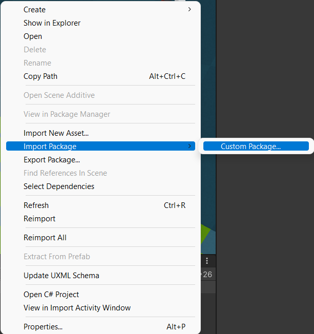
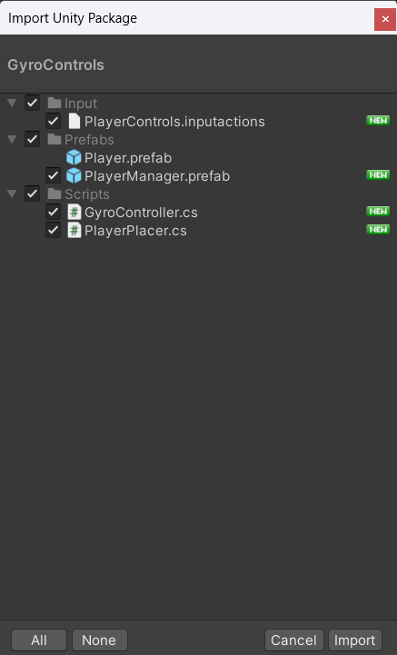
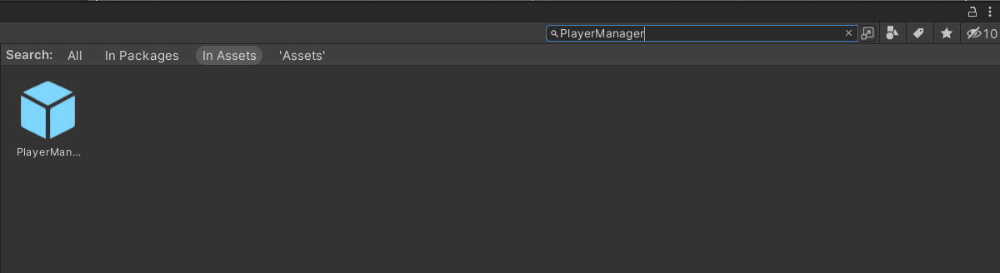
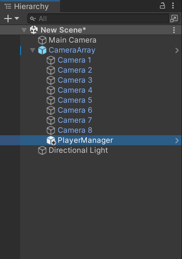
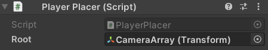
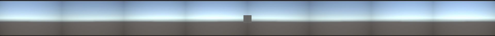

## Welcome to the Vis Gallery Gyro Controls for DualShock 4

### Developer: Phillips Albright

This unit will cover the instructions for installing and setting up gyro controls for the PlayStation DualShock 4 controller. The Gyro Controls package takes care of connection and use of one or more DualShock 4 controllers. This control scheme is meant for utilization within the Visualization Gallery in D. H. Hill Jr. Library and utilizes the 3D Camera package, so if you have not installed that package, you can find instructions for do so [here](../firstpersoncamera/gettingstarted.md).

---

## Download the Gyro Controls Package

Below you will find the link to a github repo with the camera packages. You will want to download the package file named ```GyroControls.unitypackage```.

* [Gyro Controls Package Download](https://github.com/technobotanist/VisStudioTesting/blob/main/Assets/Packages/GyroControls.unitypackage)

---

## Importing the Gyro Controls Package

With the controls package downloaded, you will now need to import it into your Unity project. To do so, go into the project window and go into your assets folder. Once there, right click and select ```Import Package > Custom Package```. Then, find the download location of the camera package in the File Explorer(Windows) or Finder(Mac) and select it.



Once you have selected the package, the ```Import Unity Package``` dialog box will display with all the items within the package. Please ensure that all items are selected/checked and then select ```Import``` at the bottom of the dialog box.



Once the package has been imported, you can find its location by either looking through the ```Prefabs``` folder in the Assets folder of the Project Window, or by searching ```PlayerManager``` within the Project Window Search bar.



---

## Integrating the Gyro Controls with the 3D Camera

Once you have found the location of the Player Manager within your project assets, drag and drop the prefab from the Project Window into the hierarchy as a child of the Camera Array.



After the Player Manager has been made a child of the Camera Array, you will need to go into the ```Player Placer``` script within the Player Manager and set the ```Root``` transform to the Camera Array's transform.



With that done, the gyro controls are ready to use. To ensure that device connection is working, you can enter play mode, press any button on your DualShock 4 controller, and you should see a block (your player) spawn in the middle of the screen (on the wall opposite the door of the Visualization Gallery), representing where your controller is facing.



The following section will go over the default control bindings.

### Gyro Controls

The default control bindings that come with the gyro controls, beyond the gyro controls themselves, are as follows:

* ```Right Analog Stick```: Secondary control for the player due to gyro controls not being 100% accurate
* ```Start```: Reset position of the player to the default position on the screen (the wall opposite the door in the Visualization Gallery)

To rebind any of these controls or to add your own, you can edit the PlayerInputs input actions object.

**Note: If you are using the gyro controls package, you will want to disable the Camera Array Controller script in the ```Camera Array```**

---

## Final Words

Once you have ensured that the gyro controls are integrated properly, then the gyro controls should be all set to be used in your project for the Visualization Gallery. In order to schedule time to test your project within the Visualization Gallery, please follow the instructions here: (```Insert link here when this is finalized```).
