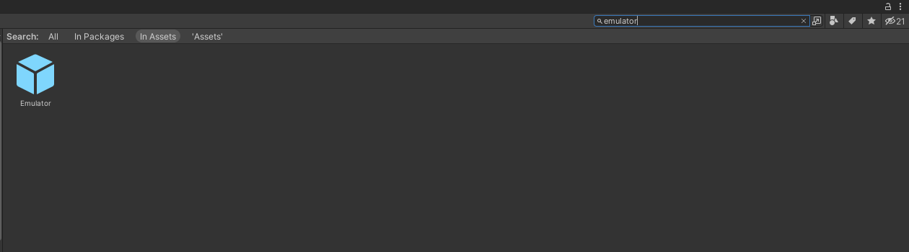
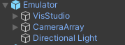
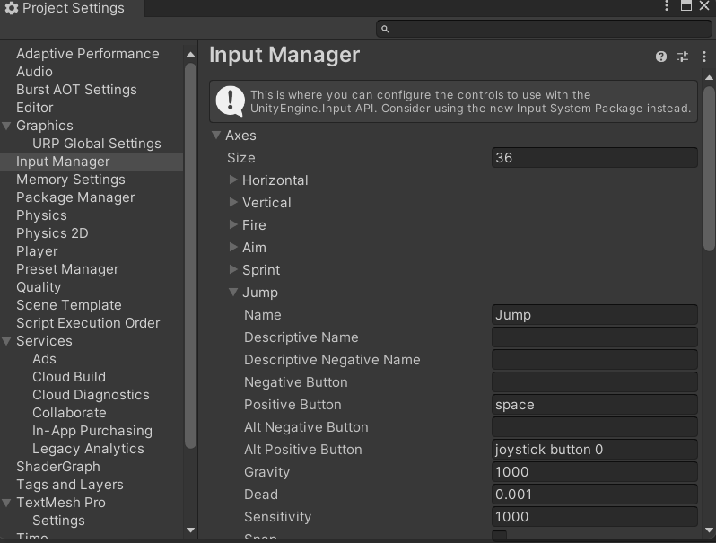
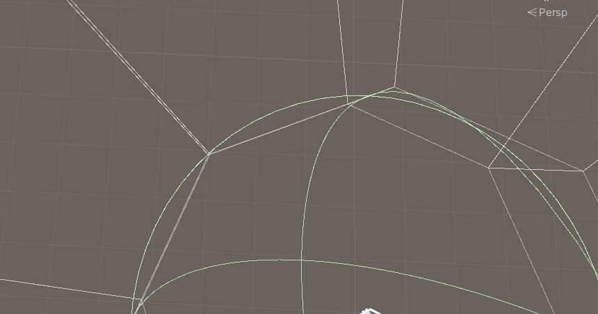

## Importing the Emulator

Please ensure that you have followed the steps from the previous "Getting Started" unit as this unit is a direct continuation of that material and requires that the camera package and emulator are downloaded and certain parameters are set in the Unity Editor.

With the emulator package downloaded, you will now need to import it into your Unity project. To do so, go into the project window and go into your assets folder. Once there, right click and select ```Import Package > Custom Package```. Then, find the download location of the camera package in the File Explorer(Windows) or Finder(Mac) and select it.


Once you have selected the package, the ```Import Unity Package``` dialog box will display with all the items within the package. Please ensure that all items are selected/checked and then select ```Import``` at the bottom of the dialog box.


Once the package has been imported, you can find the emulator by either looking through the ```Prefabs``` folder in the Assets folder of the Project Window, or by searching ```Emulator``` within the Project Window Search bar.



---

## Putting the Emulator into Your Scene

Once you have found the location of the emulator within your project assets, drag and drop the prefab from the Project Window into the scene to add the emulator.


If you already have a main camera in your scene, you will need to remove it to allow the cameras within the emulator to act as the primary cameras.

After the emulator has been placed in your scene, you will want to move around and change some of the components.



Firstly, the directional lighting in the emulator does not interact with the VisStudio, so you will want to either delete your previous directional lighting, or change it to not interact with the VisStudio. This allows for a more accurate lighting profile within the emulator.

Next up, you will want to move the VisStudio away from where the camera array will be. We recommend that you move the VisStudio far down to keep it out of the way and out of view.

Finally, you will want to move the Camera Array to where you want it in the scene.

### Camera Controls

By default, the emulator's camera array is being controlled via a ```Character Controller``` and a script called ```CameraArrayController.cs```. If you would prefer to setup your own camera controls, then you are free to do so by either editing the given scripts or by starting from scratch.

Before editing the camera controls, please keep a few things in mind:

1. If you would prefer to start from scratch, then you will need to unpack the prefab and remove the CharacterController component as well as the CameraArrayController script.
2. Please keep motion sickness in mind. The Cyma Rubin Visualization Gallery is an immersive experience, meaning extra precautions need to be taken when working with motion. We would recommend that vertical rotation of the camera array either be minimal or nonexistent. If horizontal rotation is needed, keep the speed of the rotation fairly slow. We would also recommend that any vertical motion be tightly controlled as to not cause a feeling of falling through the floor.

If you will be using the default camera controls provided, below is a list of the fields to consider when applying the camera array to your project. Understanding the specific variables and their purpose will allow you to alter them to best fit your project.


### Character Controller

* ```Radius```: This is the radius of your player. You can change this to change how far away from the player collisions will take place. (Please keep in mind that any change in radius will also require a change in the near distance of all the cameras in the array which will be described later in the ```Clipping Planes``` section)

### Camera Array Controller

* ```Walking Speed```: The horizontal speed of motion of the camera controller.
* ```Vertical Speed```: The vertical speed of motion of the camera controller.
* ```Look Speed```: The speed at which the camera array will rotate when moving the mouse left and right.

### The current controls of the camera array are as follows

* ```Horizontal Movement```: WASD
* ```Vertical Movent```: Space and Left Shift
* ```Camera Rotation```: Mouse

It is also important to note that the forward direction, unless otherwise scripted, will be positioned between the fourth and fifth cameras, even if the camera is rotated during play.

---

## Ensuring Proper Camera Setup

### Controls

If you are using the provided camera package with no alterations, you will probably notice that the camera array cannot move down during play. That is because the input for moving down is not currrently set in the project settings. To set up this control, go to ```Edit > Project Settings```.


Within the Project Settings, go to the Input Manager tab.


Within the Input Manager tab, expand the Axes dropdown and find the Jump axis.



Within the Jump axis, you will need to set the ```Negative Button``` to be whatever you choose. For our purposes, we will be using ```left shift``` (lower case is important here).


### Clipping Planes

While you are in the ```Projection``` tab, there are two fields that you may want to tweak for your project, the Clipping Planes.

1. ```Near```: The near plane is the internal distance from the center of the array where the camera can see. Anything between the character and the near plane will not be seen in the game. **If you change the radius of the Character Controller, you will need to change the near plane so that the entire interior of the camera array fits within the radius of the Character Controller.** This is to ensure that you cannot see through any object at the corners of the camera array. See reference image below for visual clarification.
2. ```Far```: The far plane is the external distance from the center of the array where the camera can see. Anything beyond the far plane will not be seen by the camera until you move closer within range to it. You may want to change the far plane for the cameras if your scene is exceptionally large or small in comparison to the camera array.



### UI

Please note that any UI that has been created will not show up correctly in the emulator as the method by which the emulator is set up does not allow for the same UI editing as the Visualization Gallery. UI will have to be tested in the Visualization Gallery for accuracy.

For information regarding setting up the UI for the Visualization Gallery, you can follow the instructions found in the 3D Camera course here (Insert link)

---

## Final Words

Once you have ensured that the camera and emulator are configured properly, if you are using the given camera controller, then the camera should be all set to be used in your project to view an emulated Visualization Gallery. Please note that you will have to delete the emulator and follow the [3D Camera Tutorial](../firstpersoncamera/gettingstarted) to replace the camera system once you wish to put it in the actual Visualization Gallery.

In order to schedule time to test your project within the Visualization Gallery, please follow the instructions here: (```Insert link here when this is finalized```).
