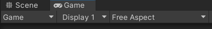
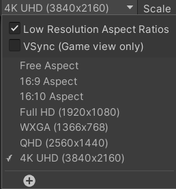

## Setting up your project

First and foremost, you are going to need a 3D Unity project to use the camera in. The camera system was developed for Unity Version 2021.3.4f1. If you already have a project created and you are adapting it for the Visualization Studio, that is perfectly fine. Just know that some of the instructions provided may differ if you are using a different version of Unity. We have done our best to keep the instructions general, but images and videos may not reflect your Unity setup.

---

## Download the 3D camera package

Below you will find the link to a github repo with the camera packages. You will want to download the package file named ```3DCamera.unitypackage```.

* [3D Camera Package Download](https://github.com/Elliott-Schultz/VisStudioTesting/blob/main/Assets/Packages/3DCamera.unitypackage)

---

## Switching to the Universal Render Pipeline

The ```Universal Render Pipeline``` was utilized to make the camera function properly along the projectors within the Visualization Studio. The Universal Render Pipeline can be installed through Unity's ```Package Manager```.

To configure your project to use Universal Render Pipeline we recommend that you follow the instructions found [here](https://www.tomstephensondeveloper.co.uk/post/unity-universal-render-pipeline-urp-initial-setup) as the instructions walk through every aspect of the configuration process.

---

## Custom Resolution

In order for the camera system to function properly, you are going to need to set up a custom resolution for your display within the Game View section of the Unity Editor. While the Visualization Studio is an array of 8 projectors, what is being displayed is considered only one display, rather than eight, with a resolution of 15360 x 1080. Think of it as all eight views being stitched together into one long string that will wrap around the space.

To set up a custom resolution, you will first need to go to the Game View screen in the Unity Editor.


Next to the dropdown labeled Display 1, you will find another dropdown with the aspect ratios.



At the bottom of that dropdown, click the option to create a custom resolution profile.



You can name the profile whatever you choose. For the purposes of this instruction, we will name it "VisStudio".


Keep the selection of Fixed Resolution and in the fields below, set the width to be ```15360``` and the height to be ```1080```.


Save the resolution and make sure that it is now the one selected from the dropdown.


In your game view, the top bar should now look like this.


