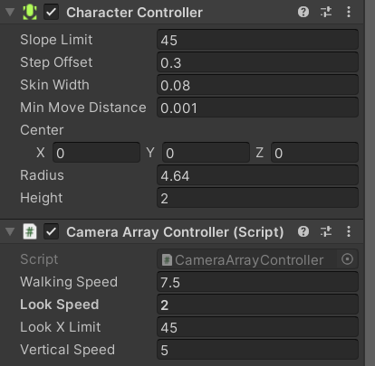
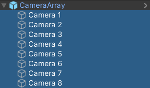

**Importing the camera**

Please ensure that you have followed the steps from the previous unit as this unit is a direct continuation from the material covered there.

With the camera package downloaded, you will need to import it into your unity project. To do so, go into the project window and go into your assets folder. There, you will right click and select ```Import Package > Custom Package``` and find the download location of the camera package.


Once you have selected the location, a new window will display with the option to select which parts of the package to install. Please ensure that all items are selected and then select ```Import```.


Once the package has been imported, you can find the camera by either finding it in the ```Prefabs``` folder in your Assets folder, or by searching for ```Camera Array``` within the Project Search bar.


---

**Putting the Camera into Your Scene**

Once you have found the location of the camera array, to add the camera to the scene, all you need to do is drag and drop the prefab from the project window into the scene.


If you already have a main camera in your scene, you will need to remove it to allow the camera array to act as the default camera.

**Camera Controls**

Currently, the camera array is being controlled via a ```Character Controller``` and a script called ```CameraArrayController.cs```. If you would prefer to setup your own camera controls, then you are free to do so by either editing the given scripts or by starting from scratch. 

Before editing the camera controls, please keep a few things in mind:

1. If you would prefer to start from scratch, then you will need to unpack the prefab and remove the CharacterController component as well as the CameraArrayController script.
2. Please keep motion sickness in mind. The Visualization Studio is an immersive experience, meaning extra precautions need to be taken when working with motion. We would recommend that vertical rotation of the camera array either be minimal or nonexistent. As for horizontal rotation, keep the speed of the rotation fairly low. We would also recommend that any vertical motion be tightly controlled as to not cause a feeling of falling through the floor.

If you will be using the camera controls that are provided, here is a list of the fields to consider when applying the camera array to your project.



Character Controller
* ```Radius```: This is the radius of your player. You can change this to change how far away from the player collisions will take place. (Please keep in mind that any change in radius will also require a change in the near distance of all the cameras in the array which will be described later in the ```Clipping Planes``` sections)

Camera Array Controller
* ```Walking Speed```: The horizontal speed of the camera controller.
* ```Look Speed```: The speed at which the camera array will rotate when moving the mouse left and right.
* ```Vertical Speed```: The vertical speed of the camera controller.

The current controls of the camera array are as follows:
* ```Horizontal Movement```: WASD
* ```Vertical Movent```: Space and Left Shift
* ```Camera Rotation```: Mouse

---

**Ensuring Proper Camera Setup**

Controls:

If you are using the provided camera array and you were to try and use it currently, you will probably notice that the camera array cannot move down. That is because the input for moving down is not set in the project settings. To set up this control, go to ```Edit > Project Settings```


Within the Project Settings, go to the Input Manager tab.


Within the Input Manager tab, expand the Axes dropdown and find the Jump axis.


Within the Jump axis, you will need to set the ```Negative Button``` to be ```left shift``` (lower case is important here).


Display Resolution:

In your game view, please ensure that the aspect ratio for Display 1 is set to the custom ```VisStudio``` resolution. If you have not set up this custom resolution, please follow the previous unit instructions to do so.


Field of View:

Once you have checked that Display 1 has the correct resolution, you should check to make sure the FOV of each of the cameras is set to 45. To do this, expand the ```Camera Array``` object in your scene and select all 8 cameras.



In the inspector, find the ```Camera``` component and expand the ```Projection``` tab. Here you will see a slider for the Field of View. Make sure that this value is set to 45.


Clipping Planes:

While you are in the ```Projection``` tab, there are two fields that you may want to tweak for your project, the Clipping Planes.

1. ```Near```: The near plane is the internal distance from the center of the array where the camera can see. Anything between the character and the near plane will not be seen in the game. **If you change the radius of the Character Controller, you will need to change the near plane so that the entire interior of the camera array fits within the radius of the Character Controller.** This is to ensure that you cannot see through anything at the corners of the camera array. See reference image below for visual clarification.
2. ```Far```: The far plane is the external distance from the center of the array where the camera can see. Anything beyond the far plane will not be seen by the camera until you move. You may want to change the far plane for the cameras if your scene is exceptionally large or small.


UI:

When working with UI for the Visualization Studio in Unity, each Canvas that you create will need to be told to use the correct screen resolution. To do this, select your UI Canvas from the Hierarchy and then in the inspector, find and expand the ```Canvas Scalar``` component. Change the ```UI Scale Mode``` to be ```Fit to Screen``` and change the ```Reference Resolution``` to be 15360x1080.


---

**Final Words**

Once you have ensured that the camera is configured properly, if you are using the given camera controller, then the camera should be all set to be used in your project within the Visualizaiton Studio. (Please note that you will not be able to see how your project looks in the Visualization Studio unless you build and run the project in the space or you use the 3D Emulator. Instructions for that are part of another course.).

In order to schedule time to test your project within the Visualization Studio, please follow the instructions here (```Insert link here```).