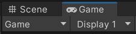
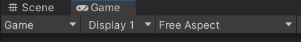
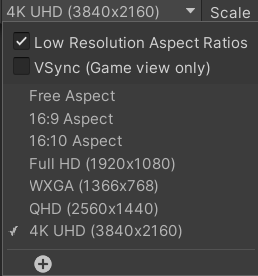
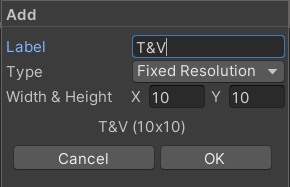
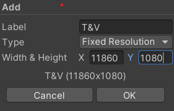
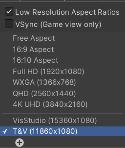

## Welcome to the VisSDK Teaching and Visualization Lab (T&V) 3D Camera

When setting up your Unity 3D project meant for the Teaching and Visualization Lab you will need to utilize a pre-built First-Person camera created for use in the space. The camera has defined features that can be altered for optimization within your specific project, however, the instructions within this section are for general use and may not pertain to a specialization you require. If any questions arise while following these instructions or adjusting the camera, please contact library_hightechspaces@ncsu.edu.

---

## Setting Up Your Project

Before anything else, you are going to need a new or existing Unity 3D project to put the camera into. The camera system was developed for Unity Version 2021.3.4f1 and if you already have a project created on a different version and you are adapting it for the Teaching and Visualization Lab, that is perfectly fine. Just know that some of the instructions provided may differ if you are using a different version and this instruction set does its best to keep the instructions general, but images and videos may not reflect your exact Unity setup.

---

## Download the T&V 3D camera package

Below you will find the link to a github repo with the camera packages. You will want to download the package file named ```3DCamera.unitypackage```.

* [T&V 3D Camera Package Download](https://go.ncsu.edu/vissdkunity_tv_camera)

---

## Switching to the Universal Render Pipeline

The ```Universal Render Pipeline``` was utilized to make the camera function properly on the projectors within the Teaching and Visualization Lab. The Universal Render Pipeline can be installed through Unity's ```Package Manager```.

To configure your project to use Universal Render Pipeline we recommend that you follow the instructions found [here](https://www.tomstephensondeveloper.co.uk/post/unity-universal-render-pipeline-urp-initial-setup) as the instructions walk through every aspect of the configuration process.

---

## Custom Resolution

In order for the camera system to function properly, you are going to need to set up a custom resolution for your display within the Game View section of the Unity Editor. While the Teaching and Visualization Lab is an array of 8 projectors, what is being displayed is considered only one display, rather than eight, with a resolution of 11860 x 1080. Think of it as all eight views being stitched together into one long string wrapping around the space.

To set up a custom resolution, you will first need to go to the Game View screen in the Unity Editor.



Next to the dropdown labeled Display 1, you will find another dropdown with the aspect ratios.



At the bottom of that dropdown, click the option to create a custom resolution profile.



You can name the profile whatever you choose. For the purposes of this instruction, we will name it "T&V".



Keep the selection of Fixed Resolution and in the fields below, set the width to be ```11860``` and the height to be ```1080```.



Save the resolution and make sure that it is now the one selected from the dropdown.



In your game view, the top bar should now look like this.


