## Importing the Camera

Please ensure that you have followed the steps from the previous "Getting Started" unit as this unit is a direct continuation of that material and requires that the camera package is downloaded and certain parameters are set in the Unity Editor.

With the camera package downloaded, you will now need to import it into your Unity project. To do so, go into the project window and go into your assets folder. Once there, right click and select ```Import Package > Custom Package```. Then, find the download location of the camera package in the File Explorer(Windows) or Finder(Mac) and select it.


Once you have selected the package, the ```Import Unity Package``` dialog box will display with all the items within the package. Please ensure that all items are selected/checked and then select ```Import``` at the bottom of the dialog box.

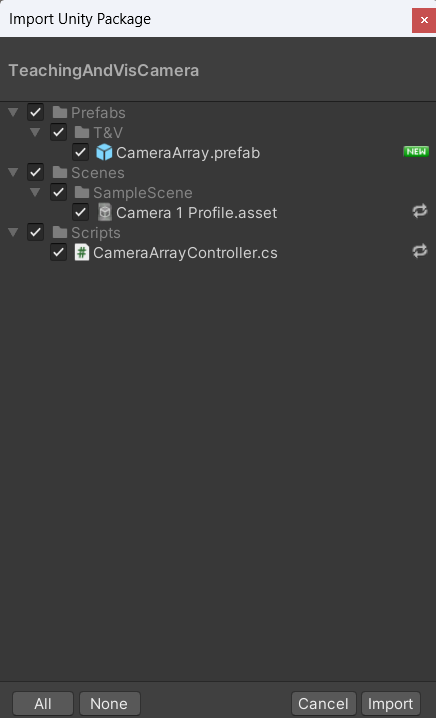

Once the package has been imported, you can find the camera by either looking through the ```Prefabs/T&V``` folder in the Assets folder of the Project Window, or by searching ```Camera Array``` within the Project Window Search bar.

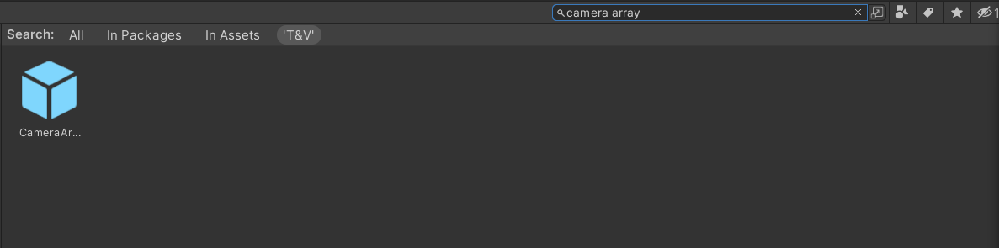

---

## Putting the Camera into Your Scene

Once you have found the location of the camera array within your project assets, drag and drop the prefab from the Project Window into the scene to add the camera.

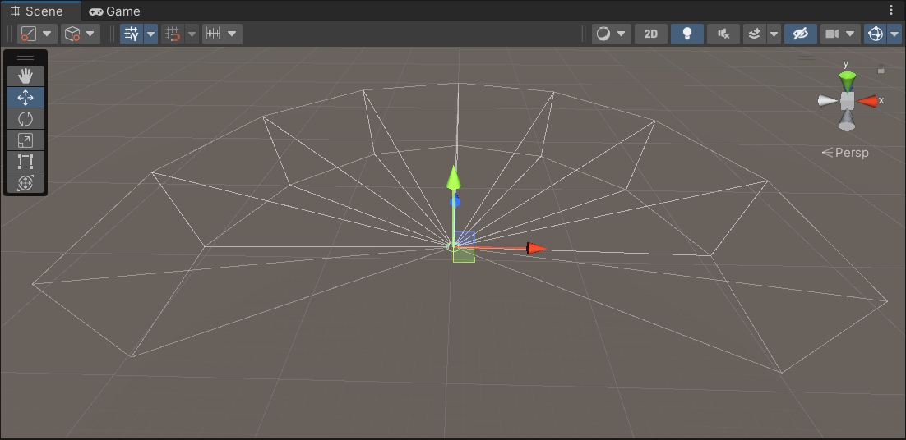

If you already have a main camera in your scene, you will need to remove it to allow the camera array to act as the default camera.

### Camera Controls

By default, the camera array is being controlled via a ```Character Controller``` and a script called ```CameraArrayController.cs```. If you would prefer to setup your own camera controls, then you are free to do so by either editing the given scripts or by starting from scratch.

Before editing the camera controls, please keep a few things in mind:

1. If you would prefer to start from scratch, then you will need to unpack the prefab and remove the CharacterController component as well as the CameraArrayController script.
2. Please keep motion sickness in mind. The Teaching and Visualization Lab is an immersive experience, meaning extra precautions need to be taken when working with motion. We would recommend that vertical rotation of the camera array either be minimal or nonexistent. If horizontal rotation is needed, keep the speed of the rotation fairly slow. We would also recommend that any vertical motion be tightly controlled as to not cause a feeling of falling through the floor.

If you will be using the default camera controls provided, below is a list of the fields to consider when applying the camera array to your project. Understanding the specific variables and their purpose will allow you to alter them to best fit your project.

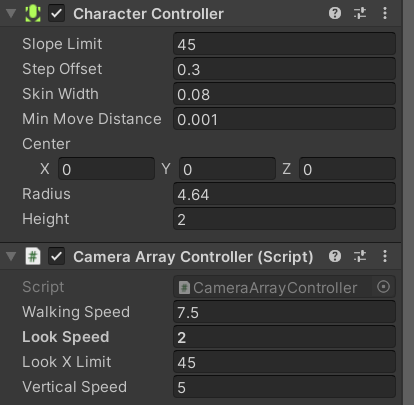

### Character Controller

* ```Radius```: This is the radius of your player. You can change this to change how far away from the player collisions will take place. (Please keep in mind that any change in radius will also require a change in the near distance of all the cameras in the array which will be described later in the ```Clipping Planes``` section)

### Camera Array Controller

* ```Walking Speed```: The horizontal speed of motion of the camera controller.
* ```Vertical Speed```: The vertical speed of motion of the camera controller.
* ```Look Speed```: The speed at which the camera array will rotate when moving the mouse left and right.

### The current controls of the camera array are as follows

* ```Horizontal Movement```: WASD
* ```Vertical Movent```: Space and Left Shift
* ```Camera Rotation```: Mouse

It is also important to note that the forward direction, unless otherwise scripted, will be positioned between the fourth and fifth cameras, even if the camera is rotated during play.

---

## Ensuring Proper Camera Setup

### Controls

If you are using the provided camera package with no alterations, you will probably notice that the camera array cannot move down during play. That is because the input for moving down is not currrently set in the project settings. To set up this control, go to ```Edit > Project Settings```.

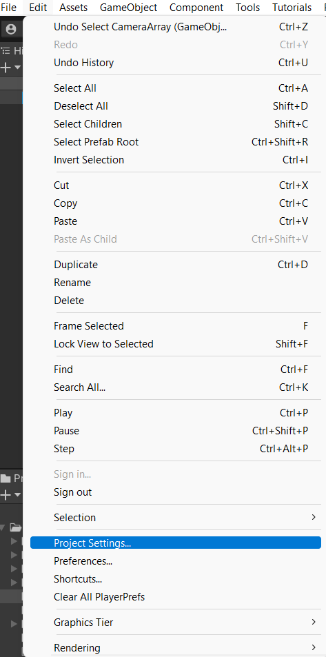

Within the Project Settings, go to the Input Manager tab.

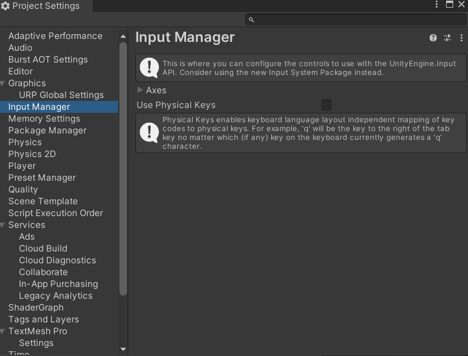

Within the Input Manager tab, expand the Axes dropdown and find the Jump axis.

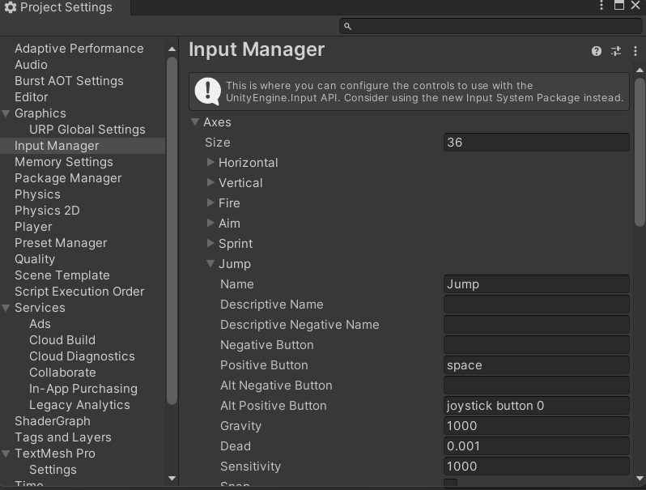

Within the Jump axis, you will need to set the ```Negative Button``` to be whatever you choose. For our purposes, we will be using ```left shift``` (lower case is important here).

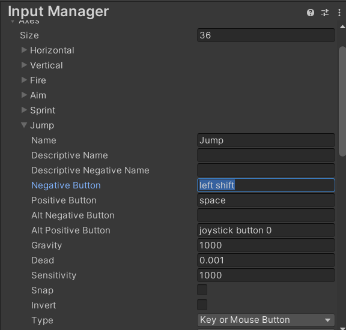

### Display Resolution

In your Game View, please ensure that the aspect ratio for Display 1 is set to the custom ```T&V``` resolution. If you have not set up this custom resolution, please follow the instructions from the previous unit to do so.

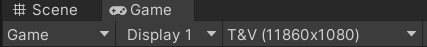

### Field of View

Once you have checked that Display 1 has the correct resolution, you need to check to make sure the Field-of-View (FOV) of each of the cameras is set to 27.125. To do this, expand the ```Camera Array``` object in your scene and select all 8 cameras.

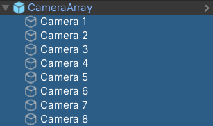

In the Inspector, find the ```Camera``` component and expand the ```Projection``` tab. Here you will see a slider for the Field of View. Make sure that this value is set to 27.125.

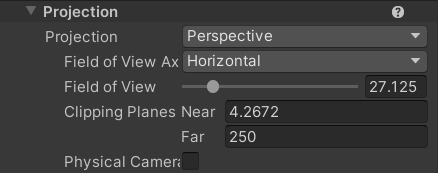

### Clipping Planes

While you are in the ```Projection``` tab, there are two fields that you may want to tweak for your project, the Clipping Planes.

1. ```Near```: The near plane is the internal distance from the center of the array where the camera can see. Anything between the character and the near plane will not be seen in the game. **If you change the radius of the Character Controller, you will need to change the near plane so that the entire interior of the camera array fits within the radius of the Character Controller.** This is to ensure that you cannot see through any object at the corners of the camera array. See reference image below for visual clarification.
2. ```Far```: The far plane is the external distance from the center of the array where the camera can see. Anything beyond the far plane will not be seen by the camera until you move closer within range to it. You may want to change the far plane for the cameras if your scene is exceptionally large or small in comparison to the camera array.

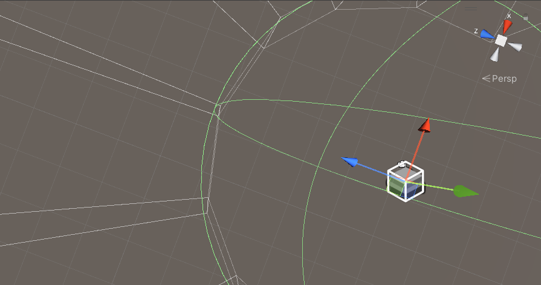

### UI

When working with UI for the Teaching and Visualization Lab in Unity, each Canvas that you create will need to be told to use the correct screen resolution. To do this, select your UI Canvas from the Hierarchy. Then in the Inspector, find and expand the ```Canvas Scalar``` component. Change the ```UI Scale Mode``` to be ```Fit to Screen``` and change the ```Reference Resolution``` to be 11860 x 1080.

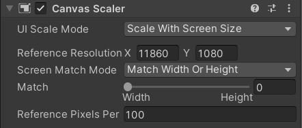

---

## Final Words

Once you have ensured that the camera is configured properly, if you are using the given camera controller, then the camera should be all set to be used in your project within the Teaching and Visualization Lab. Please note that you will not be able to see how your project looks in the Teaching and Visualization lab unless you build and run the project in the space. Play mode will only show a reduced size and will not wrap around the entire screen, even if the ```Maximize on Play``` option is selected.

In order to schedule time to test your project within the Teaching and Visualization Lab, please follow the instructions here: (```Insert link here when this is finalized```).
