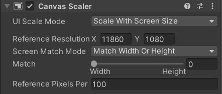

## Making Scenes for the Teaching and Visualization Lab

---

### Full Utilization of the Screen

When developing 2D scenes for the Teaching and Visualization Lab, there is much of a difference from developing a normal 2D scene other than the fact that the scene will be much longer than a normal 2D scene. Keeping in mind the amount of screen real estate that is available to use from the start of the project will help you make decisions about how you will develop your scene and whay you may or may not be able to do with your project.

---

### UI

When working with UI for the Teaching and Visualization Lab in Unity, each Canvas that you create will need to be told to use the correct screen resolution. To do this, select your UI Canvas from the Hierarchy. Then in the Inspector, find and expand the ```Canvas Scalar``` component. Change the ```UI Scale Mode``` to be ```Fit to Screen``` and change the ```Reference Resolution``` to be 11860 x 1080.



---

### Motion Sickness

Please keep motion sickness in mind. The Teaching and Visualization Lab is an immersive experience, meaning extra precautions need to be taken when working with motion. We would recommend that vertical rotation of the camera either be minimal or nonexistent. If horizontal rotation is needed, keep the speed of the rotation fairly slow. We would also recommend that any vertical motion be tightly controlled as to not cause a feeling of falling through the floor.

---

### Final Words

Once you have ensured that your scene is configured properly for 2D in the Teaching and Visualization Lab, then your 2D project should be ready to be used within the Visualization Studio. Please note that you will not be able to see how your project looks in the Teaching and Visualization Lab unless you build and run the project in the space. Play mode will only show a reduced size and will not wrap around the entire screen, even if the ```Maximize on Play``` option is selected.

In order to schedule time to test your project within the Teaching and Visualization Lab, please follow the instructions [here](https://go.ncsu.edu/libraries_hts_request).
