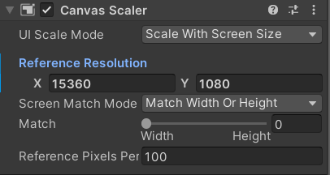

## Making Scenes for the Visualization Gallery

---

### Full Utilization of the Screen

When developing 2D scenes for the Cyma Rubin Visualization Gallery, one of the main challenges you will face is what to do with the point where the right edge of the screen meets the left edge of the screen. What is displayed when running your scene is one continuous screen, so you must think about how it all blends together at that end point. Keeping this in mind from the start will help you make decisions about how you will develop your scene and what you may or may not be able to do with your project.

If you would like, for reference on scenes that take show some of the ways to work with this edge zone, take a look at this suite of demos: (Insert Hank's Haven link).

---

### UI

When working with UI for the Visualization Gallery in Unity, each Canvas that you create will need to be told to use the correct screen resolution. To do this, select your UI Canvas from the Hierarchy. Then in the Inspector, find and expand the ```Canvas Scalar``` component. Change the ```UI Scale Mode``` to be ```Fit to Screen``` and change the ```Reference Resolution``` to be 15360 x 1080.



---

### Motion Sickness

Please keep motion sickness in mind. The Visualization Gallery is an immersive experience, meaning extra precautions need to be taken when working with motion. We would recommend that vertical rotation of the camera either be minimal or nonexistent. If horizontal rotation is needed, keep the speed of the rotation fairly slow. We would also recommend that any vertical motion be tightly controlled as to not cause a feeling of falling through the floor.

---

### Final Words

Once you have ensured that your scene is configured properly for 2D in the Visualization Gallery, then your 2D project should be ready to be used within the Visualization Studio. Please note that you will not be able to see how your project looks in the Visualization Gallery unless you build and run the project in the space. Play mode will only show a reduced size and will not wrap around the entire screen, even if the ```Maximize on Play``` option is selected. 

In order to schedule time to test your project within the Visualization Gallery, please follow the instructions here (```Insert link here when this is finalized```).
