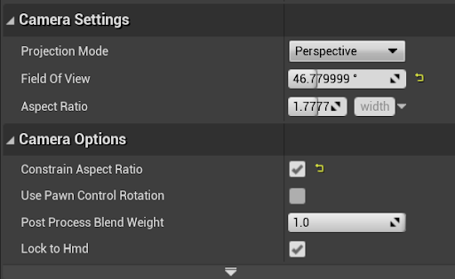
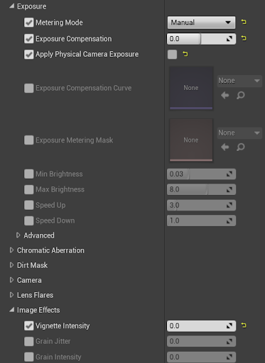
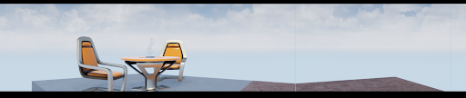
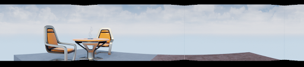
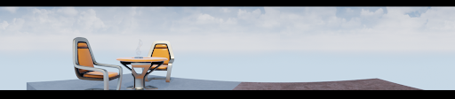
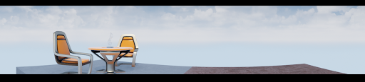
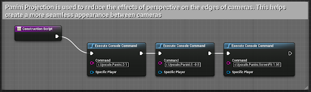
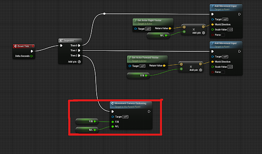

#### Below, you will find information about the key C++ classes and Blueprints that are used to adapt projects for use in the Visualization Studio, as well as some basic functionality information. Most of this information describes what these elements do, so it is recommended that you read this section. However, this information isn’t necessarily critical for basic use.

---

## Major Blueprints and Classes:
### VizStudioGameInstance
* This should be selected as the Game Instance Class in the Maps & Modes tab of the Project Settings
* A C++ class the handles the creation of new players with the proper settings

### VizGameMode
* Should be set as the Default GameMode in the Maps & Modes tab of the Project Settings
* Handles the spawning, positioning, and appropriate parenting of all player Pawns and applies important settings for rendering
* Spawns 9 local players using the VizStudioGameInstance C++ class (these are all VizCameraReceiverPawns
    * Upon completion, the first of those Pawns is Unpossessed and Destroyed before being replaced by a VizParentPawn to which all of the other VizCameraReceiverPawns are attached, each offset to form a circle.
* Executes console commands to perform Panini Projection
    * Unreal’s Panini Projection is used to reduce the effects of perspective on the edges of the cameras. This helps create a more seamless appearance between cameras.
* Spawns an ASplitScreenManagerBP actor in the level when play begins

### ASplitScreenManager/ASplitScreenManagerBP
* A C++ class and an actor from that class that overrides and applies new settings to allow for 9 local players with 8 total cameras in split screen
    * These 9 players consist of 8 VizCameraReceiverPawns and 1 VizParenPawn

### VizCameraReceiverPawn
* This BP actor is a player Pawn that consists of a camera with appropriate settings. 
* This class is intended purely as an owner for a camera. They should not be directly edited or changed at runtime. These changes should be made through the VizParentPawn.
* *This Pawn is possessed by a PlayerController*

### VizParentPawn
* This BP actor should be thought of as the main player Pawn.
* Movement and other inputs should be handled by this Pawn. The VizCameraReceiverPawns are attached to this Pawn, so they are moved by it.
    * Additionally, this Pawn contains arrays with references to each of the VizCameraReceiverPawns and their Camera components.
* *This Pawn is possessed by a VizPlayerController*

### VizPlayerController
* The PlayerController class that possesses the VizParentPawn

---

## VizCameraReceiverPawn Camera Settings:
The unique arrangement of cameras requires that a few camera and post processing settings remain unchanged.

These settings are:
* Field of View (46.779999)
* Aspect Ratio (1.7777777)
* Constrain Aspect Ratio (True)
* Exposure (The following settings must be enabled and set to the following values)
    * Metering Mode (Manual)
    * Exposure Compensation (0.0)
    * Apply Physical Camera Exposure (False)
* Image Effects (The following setting must be enabled and set to the following value)
    * Vignette Intensity (0.0)

Note the particular Field of View (46.779999) Aspect Ratio, and the fact that Constrain Aspect Ratio has been set to TRUE.

The FOV is atypical, but it is critical because of settings in the Game Mode Blueprint that make use of Unreal Engine’s Panini Projection tools. More on Panini Projection later.

The Aspect Ratio is set to a standard 16:9 to match the resolutions of each of the Visualization Studio's projectors.

Constrain Aspect Ratio is useful for making sure that the cameras always line up regardless of the size of the viewport. There are limitations to this, but it helps a lot in testing.

Exposure settings have been set to Manual, with a base compensation of 0.0. This is critical to maintaining a consistent brightness across all cameras.

Enabling the Apply Physical Camera Exposure setting while turning the setting itself off prevents the screen from being black.

Vignette Intensity must be enabled and set to 0.0. If this setting is disabled, the default value is 0.4, which creates darkened edges around each of the cameras.

---

## Panini Projection — An Issue of Perspective:
Tiling perspective cameras creates issues. At the edges, where the cameras meet, you’re likely to encounter conflicting perspectives as you can see in the floor here:

Note: the FOV is set to 45 degrees so that each of the 8 cameras owns exactly ⅛ of the screen.

To reduce this effect, Panini Projection is used, which essentially warps the display, creating an effect like this:

As you can see, though, the warping causes the edges of the views to draw inward. This can be fixed with the Panini Projection’s ScreenFit setting:

If you look carefully at the table in this shot, you can see that the places where the cameras meet are no longer properly aligned. This requires tweaking of the FOV to achieve a positive effect:

The Panini Projection settings can be seen here, applied in the Construction Script of the VizGameMode Blueprint:

For improved legibility, the Execute Console Command nodes, in order, say:
<ul>
  <li>r.Upscale.Panini.D 1</li>
  <li>r.Upscale.Panini.S -0.5</li>
  <li>r.Upscale.Panini.ScreenFit 1.95</li>
</ul>
    * r.Upscale.Panini.D 1
    * r.Upscale.Panini.S -0.5
    * r.Upscale.Panini.ScreenFit 1.95

---

## Built-In Controls

It is important to know that all input should be handled by the VizParentPawn. All of the other camera-containing actors will be attached to this actor on startup, and they will move when it does.

By default, the VizParentPawn can only move forward/backward (W and S keys, respectively) and left/right (A and D keys, respectively). It is recommended that you replace these inputs with your own input bindings.

*If these bindings are replaced, references to the variable F/B can and should be replaced by the axis values for forward/backward movement (full forward being +1 and full backward being -1). The same should be done for R/L and right/left movement (full right being +1 and full left being -1).*

There is no rotation by default due to simulator sickness concerns. This input must be added manually if desired.

By default, movement causes cameras other than those facing the direction of the movement to darken. This is to reduce simulator sickness. This function can be disabled in the VizParentPawn BP.

